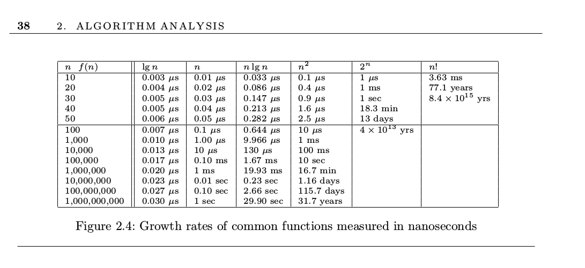

## Growth Rates

My favorite bit from this chapter was the growth rate chart. 

## Implications

- A for loop in a for loop (N^2) will work acceptably if you've got less than 1000 items, but contribute to noticeable user interface
delay if it's 10,000+. 
- Sorting 100,000 items is no big deal and we're also all used to querying databases (which often have to do different sorting and index seeking that is n log n) taking up to a few seconds, which makes sense for 100 million things.
- Linear time operations won't have noticeable user interface lagginess until 100 million and up. Around this point if you can optimize your linear time to be a 'smaller' linear time, like 3N to 2N it can definitely be useful! In practice not all O(N) is the same.

